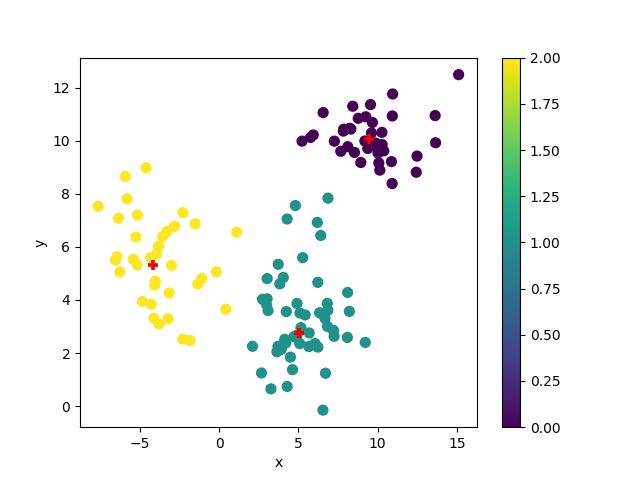
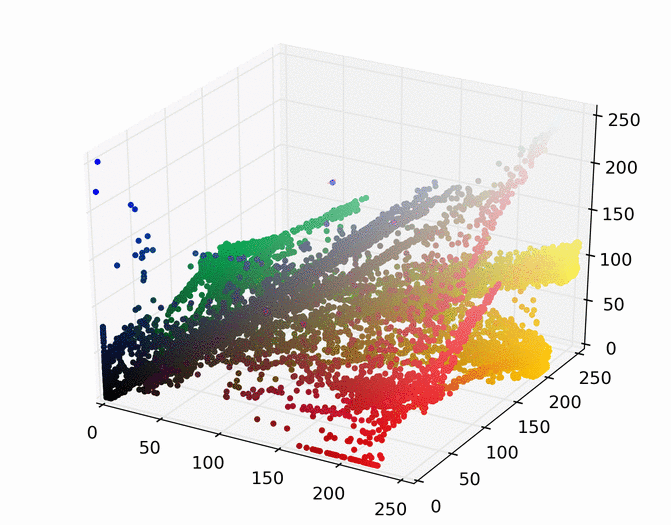

## Mean Shift Clustering
MeanShift_py is a simple implementation of [mean shift](http://en.wikipedia.org/wiki/Mean_shift) clustering in python.


<table>
<tr>
<td></td>
<td></td>
</tr>
</table>

### Dependencies
The only dependency is [Numpy](http://www.numpy.org/)

### Description
The `mean_shift.py` module defines a class called `MeanShift`. The `MeanShift` class constructor takes in an optional kernel parameter. If no kernel is specified, a default [Gaussian](http://en.wikipedia.org/wiki/Gaussian_function) kernel is used.

The `cluster` method requires an array of points and a kernel bandwidth value. A optional `iteration_callback` function can also be passed in that will be called back at the end of each mean shift iteration with the current state of the algorithm (e.g., where the points are currently at, along with an iteration number).

After the clustering finishes, a `MeanShiftResult` object is returned, containing three arrays:

1. The original points
2. The shifted points
3. Cluster assignments for each point

### Usage
```python
import mean_shift as ms

data = get_data_from_somewhere()
mean_shifter = ms.MeanShift()
mean_shift_result = mean_shifter.cluster(data, kernel_bandwidth = 10)

original_points =  mean_shift_result.original_points
shifted_points = mean_shift_result.shifted_points
cluster_assignments = mean_shift_result.cluster_ids

# If you want to use multivariate gaussian kernel
# By default it uses unviariate gaussian kernel
# Make sure the dimensions of 'data' and the kernel match
mean_shifter = ms.MeanShift(kernel='multivariate_gaussian')
mean_shift_result = mean_shifter.cluster(data, kernel_bandwidth = [10,20,30])
```

### Example
#### Plotting Into Graph
This is example using matplotlib to plot graphs
```python
import mean_shift as ms
import matplotlib.pyplot as plt
import numpy as np

data = np.genfromtxt('data.csv', delimiter=',')

mean_shifter = ms.MeanShift()
mean_shift_result = mean_shifter.cluster(data, kernel_bandwidth = 1)

original_points =  mean_shift_result.original_points
shifted_points = mean_shift_result.shifted_points
cluster_assignments = mean_shift_result.cluster_ids

x = original_points[:,0]
y = original_points[:,1]
Cluster = cluster_assignments
centers = shifted_points

fig = plt.figure()
ax = fig.add_subplot(111)
scatter = ax.scatter(x,y,c=Cluster,s=50)
for i,j in centers:
    ax.scatter(i,j,s=50,c='red',marker='+')
ax.set_xlabel('x')
ax.set_ylabel('y')
plt.colorbar(scatter)

fig.savefig("mean_shift_result")
```



#### Image Segmentation
Mean shift can be used for image segmentation. Below is an example of an image being mean shift clustered in 3D RGB space, resulting in 7 clusters.



<table border="0">
<tr>
<td></td>
<td></td>
</tr>
</table>


